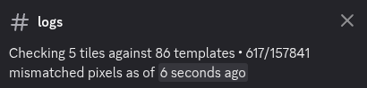

# wplace-griefscan
A [**highly experimental**](https://github.com/nyakase/wplace-griefscan/commit/8fca51d9471951165e8eda39af3c39dca57d3b31) Discord bot to report [Wplace](https://wplace.live) griefing to a Discord channel. It does not place pixels for you.

## Installation
These are step-by-step instructions for my personal setup. I use [Bun](https://bun.sh/) and [pm2](https://pm2.keymetrics.io/docs/usage/quick-start/) to run the bot but you can probably infer how to run it with different tools.
1. `git clone https://github.com/nyakase/wplace-griefscan && cd wplace-griefscan`
2. [Create and add a Discord bot to your Discord server.](https://discordpy.readthedocs.io/en/stable/discord.html)
3. Create a `.env` file and add the bot token as `DISCORD_TOKEN`.
4. Create a Discord channel for the bot and ensure it has the "Manage Channels" permission for it.
5. Add the [channel ID](https://support.discord.com/hc/en-us/articles/206346498-Where-can-I-find-my-User-Server-Message-ID) to the `.env` file as `DISCORD_CHANNEL`.
6. [Add templates to the `templates` folder.](templates/README.md) Updating templates requires a manual restart.
7. `pm2 start --interpreter /usr/bin/bun --name griefscan src/index.ts` (change `/usr/bin/bun` if it's somewhere else)

If the first scan went well you'll see the channel topic update to show scanner information. If not, see if `pm2 log griefscan` has useful information.

